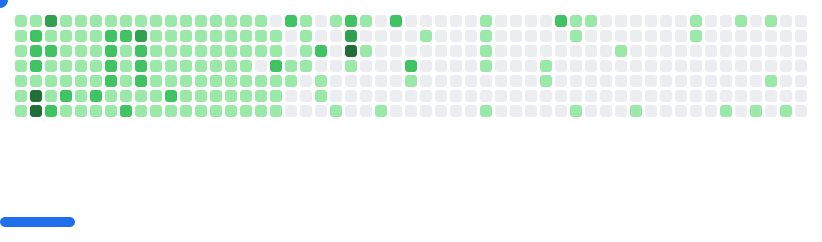

 
 
 

<h3> Hello, I'm Kang Choi / 최 강  </h3>
I majored in <strong>Computer Science</strong> at <strong>Hansung University</strong> and am currently working as a <strong>full-stack web developer</strong> in the field of <strong>automotive cybersecurity</strong>.  
I have a strong interest in exploring diverse technologies and continuously learning new skills.  
My goal is to contribute to building safer and more efficient systems through growth as a developer.
<!-- 

   

 -->
<picture>
  <source media="(prefers-color-scheme: dark)" srcset="images/breakout-dark.svg" />
  <source media="(prefers-color-scheme: light)" srcset="images/breakout-light.svg" />
  
</picture>

<h2>Tech Stack</h2>

   

